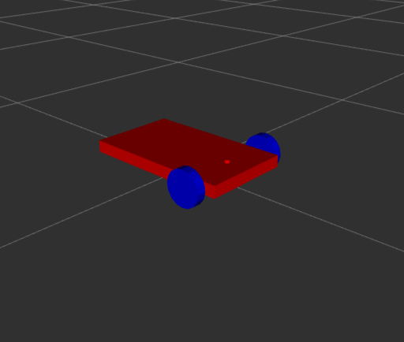
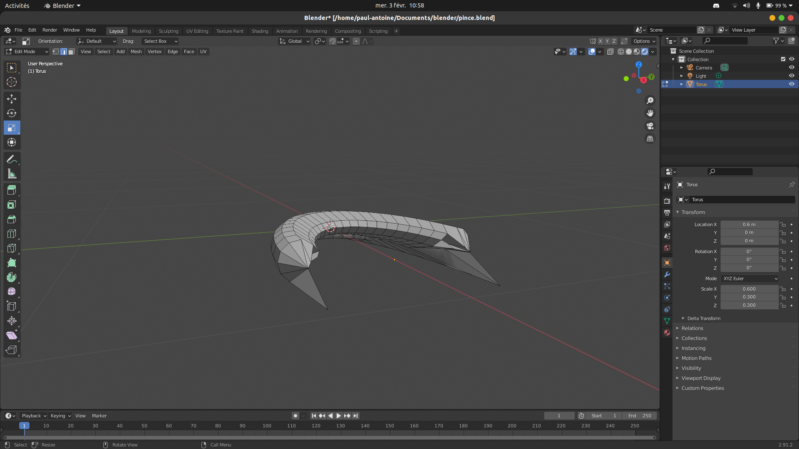

# Tennis Ball Collector

## Projet 

### Introduction

Projet de cours d'ingénierie système et modélisation robotique à l'ENSTA Bretagne en 2021.
L'objectif du projet est de créer un robot évoluant sur un court de tennis, capable de récupérer les balles de tennis qui tombent sur le court à des positions aléatoires.
Le robot doit être capable d'ograniser ses déplacement de façon à récupérer les balles dans un ordre défini.
En effet, plus une balle reste longtemps sur le court plus le score est mauvais.

### Environnement 
Le robot évolue sur un court de tennis. Des balles tombent aléatoirement sur le court de tennis. 
L'objectif du robot est de récupérer les balles et de les ramener dans les zones de dépose (orange).
Chaque balle doit être ramenée le plus rapidement possible.
En effet, le score qu'ajoute le dépôt d'une balle dans la zone de dépôt diminue de façon proportionnelle au temps qu'a passée la balle sur le court de tennis.


L'environnement est composé d'une caméra zenital qui permet de detecter les balles grâce à une homographie planaire.


### Architecture du robot
L'architecture du robot se divise en deux partie principalement :
* L'architecture mobile 
* le collecteur de balles
  
#### L'architecture mobile 
il s'agit d'un robot à trois roues.
Deux roues directrices et une roue folle.


### Collecteur de balles
Nous avons décidé de créer le collecteur de balles sous blender.
Ce collecteur en est à l'état du concept. En effet nous cherchons la forme optimal pour atrapper un maximum de balles sans les perdres.
Pour l'instant nous ne prenons pas en compte le côté usinable du collecteur.


La version finale du robot dans son environnement :


## Lancer la simulation

### Dépendences

###### A compléter avec la/les dépendences.


### Démarrer la simulation

```bash
colcon build --symlink-install

. install/setup.bash

ros2 launch tennis_court tennis_court.launch.py

# Balls Localization 

ros2 run tennis_court read_camera.py

# Spawn the Robot

ros2 launch robot_tennis_gazebo spawner.launch.py

```


## Groupe

### Membres

* **Jules Berhault** - 
* **Quentin Brateau** -  [Teusner](https://github.com/Teusner) :sunglasses:
* **Paul-Antoine Le Tolguennec** - [Paul-antoineLeTolguenec](https://github.com/Paul-antoineLeTolguenec)
* **Gwendal Priser** - [gwendalp](https://github.com/gwendalp) :ocean:

### Gestion de projet

Voici le lien [Taiga](https://tree.taiga.io/project/gwendalp-tennis-ball-collector/timeline).
https://tree.taiga.io/project/gwendalp-tennis-ball-collector/timeline


## Structure du dépôt

Ce dépôt doit être cloné dans le dossier `src` d'un workspace ROS 2.

### Package `tennis_court`

Le dossier `tennis_court` est un package ROS contenant le monde dans lequel le robot ramasseur de balle devra évoluer ainsi qu'un script permettant de faire apparaître des balles dans la simulation.
Ce package ne doit pas être modifié.
Consulter le [README](tennis_court/README.md) du package pour plus d'informations.

### Package `robot_tennis`

Le dossier `robot_tennis` est le dossier contenant la description du robot implémenté ppour résoudre le problème de récupération des balles.
Les fichiers de descriptions contiennent principalement:
* L'architecture du robot mobile 
* Les capteurs embarqués
* Le collecteur de balle

### Package `robot_tennis_controller`

Le dossier `robot_tennis_controller` les algorithmes de navigations du robot.
La partie décisionnelle du robot se divise 3 partie principales:
* Detections des balles
* Ordonnancement des balles à récupérer
* Récupération des balles 


### Documents

Le dossier `docs` contient tous les documents utiles au projet:
- Des [instructions pour utiliser Git](docs/GitWorkflow.md)
- Un [Mémo pour ROS 2 et Gazebo](docs/Memo_ROS2.pdf)
- Les [slides de la présentation Git](docs/GitPresentation.pdf)


### Rapports

Le dossier `reports` doit être rempli avec les rapports d'[objectifs](../reports/GoalsTemplate.md) et de [rétrospectives](../reports/DebriefTemplate.md) en suivant les deux templates mis à disposition. Ces deux rapports doivent être rédigés respectivement au début et à la fin de chaque sprint.
